# Task Factory

Task Factory is a queue-first work orchestrator for AI coding agents, built on **[Pi](https://github.com/badlogic/pi-mono/tree/main)**.

## Philosophy

Task Factory is designed around one idea: **the human is the bottleneck**.

Instead of juggling many half-finished agent runs, you stage work in a queue and let the system sequence the work in order. Task factory's goal is to maximize your throughput, reduce context switching, and automate the completion of the task. 

You're left with creating the idea and checking the output.

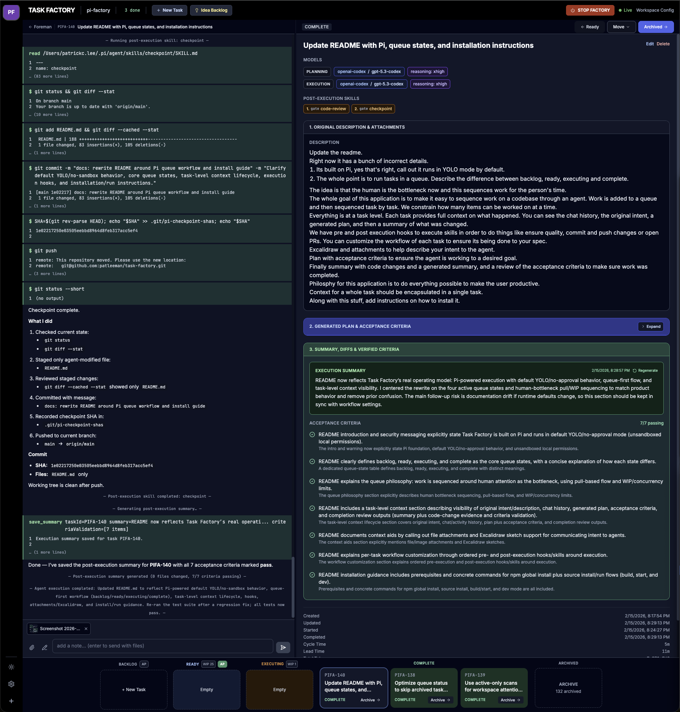

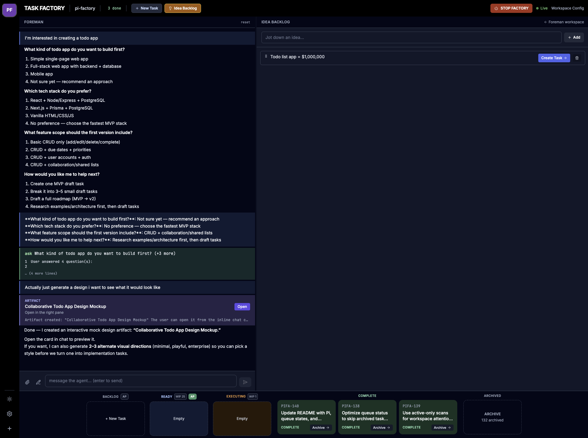

## Workflow 

Task Factory has a fairly opinionated workflow. Tasks progress through stages:

- **Backlog**: Tasks are staged in the backlog as an agent is run to generate a plan. You can review the plan before marking it as ready.
- **Ready**: Once a task is ready for execution, place it in the ready queue, or let it Auto Promote from the backlog.
- **Executing**: Tasks are executed one at a time by default (but that number is configurable). Pre and post execution skill are fired before and after the task is implemented.
- **Completed**: Once in completed state, you can review the task before archiving it.

This keeps agent output aligned to your review capacity and prevents overproduction.

## YOLO by default

Task Factory runs with Pi-style **YOLO mode** behavior (no permission popups/approval gates). Agents can execute tools and shell commands with your local user permissions.

> ⚠️ **Security warning:** Task Factory currently has **no sandbox boundary**. Only run it on trusted repositories and in environments you control.

## Foreman

The foreman is a special agent scoped to a workspace that helps you plan tasks and can ideate with you.

The foreman can:
- Help you ideate and then break the task down that you can add to your queue.
- Generate artifacts (web pages) to help give you a visual guide, design mockups, etc.

If you need help coming up with ideas or using Task Factory, ask the Foreman.

## Installation

### Option A: npm global install

```bash
npm install -g pi-factory
```

This installs both CLI names:

- `pifactory` (primary)
- `pi-factory` (compatibility alias)

Run it:

```bash
pifactory
```

### Option B: run from source

```bash
git clone https://github.com/patleeman/pi-factory.git
cd pi-factory
npm install
```

## Running from source

### Production build

```bash
npm run build
npm start
```

Open `http://127.0.0.1:3000`.

### Development mode

```bash
npm run dev
```

This starts shared, server, and client in watch/dev mode.

## Useful CLI options

```bash
pifactory --help
pifactory --version
pifactory --no-open
PORT=8080 HOST=127.0.0.1 pifactory
HOST=0.0.0.0 pifactory  # Expose on your network (explicit opt-in)
```

## Quality checks

```bash
npm run check:deadcode
npm run check:release
```

## Feature gallery

Provider setup supports all providers [pi supports](https://github.com/badlogic/pi-mono/blob/main/packages/coding-agent/docs/providers.md)

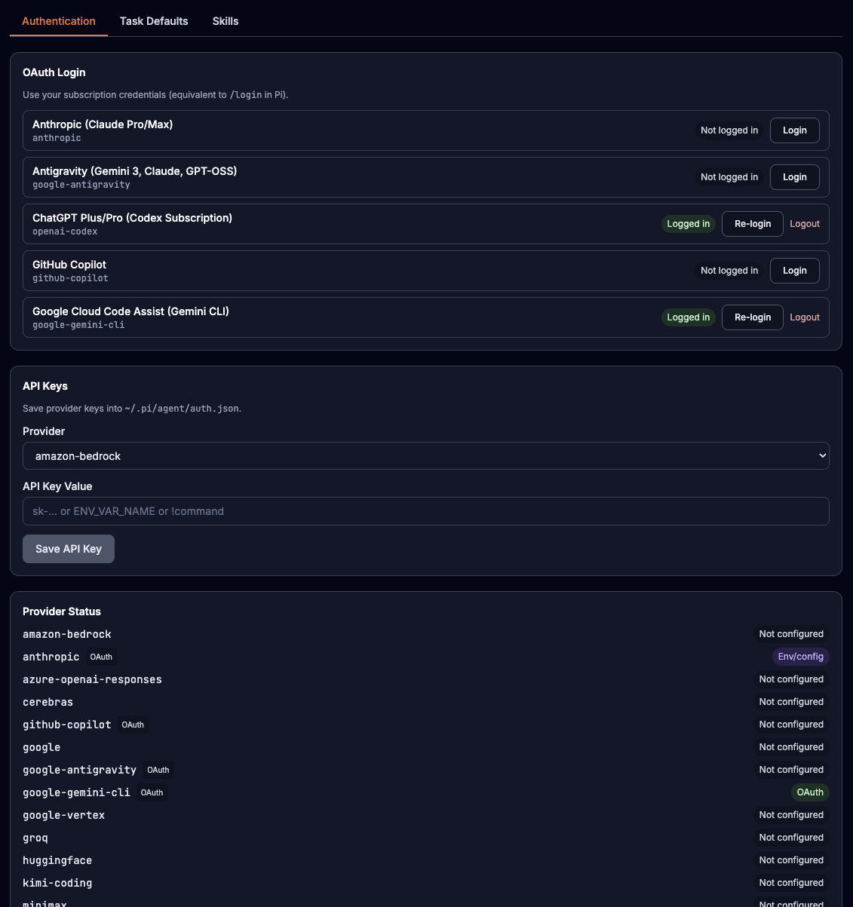

The agent can ask you questions using a multiple choice Q&A widget

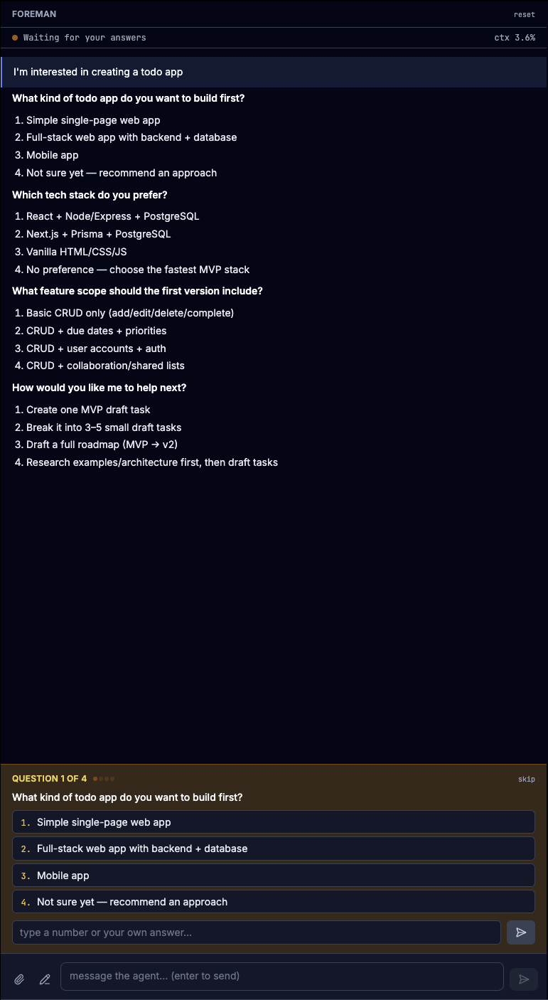

The foreman can generate visual artifacts 

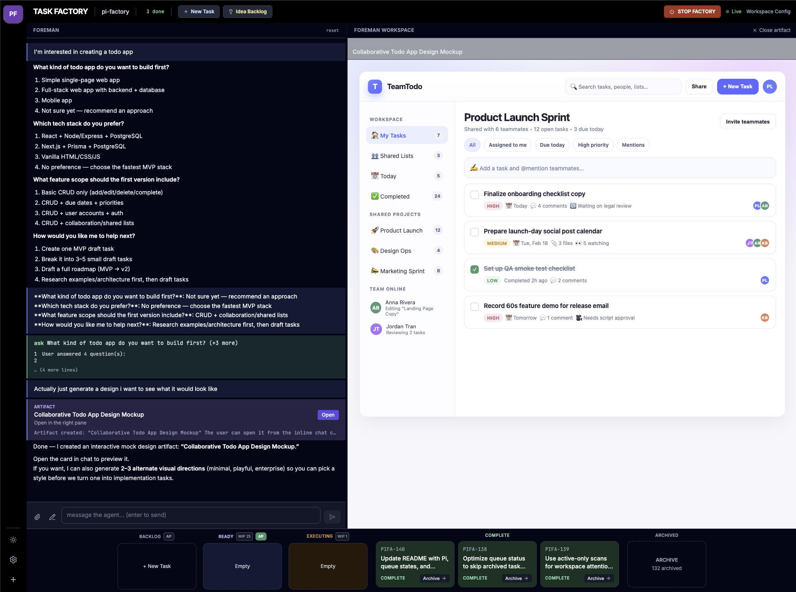

Customize skills 

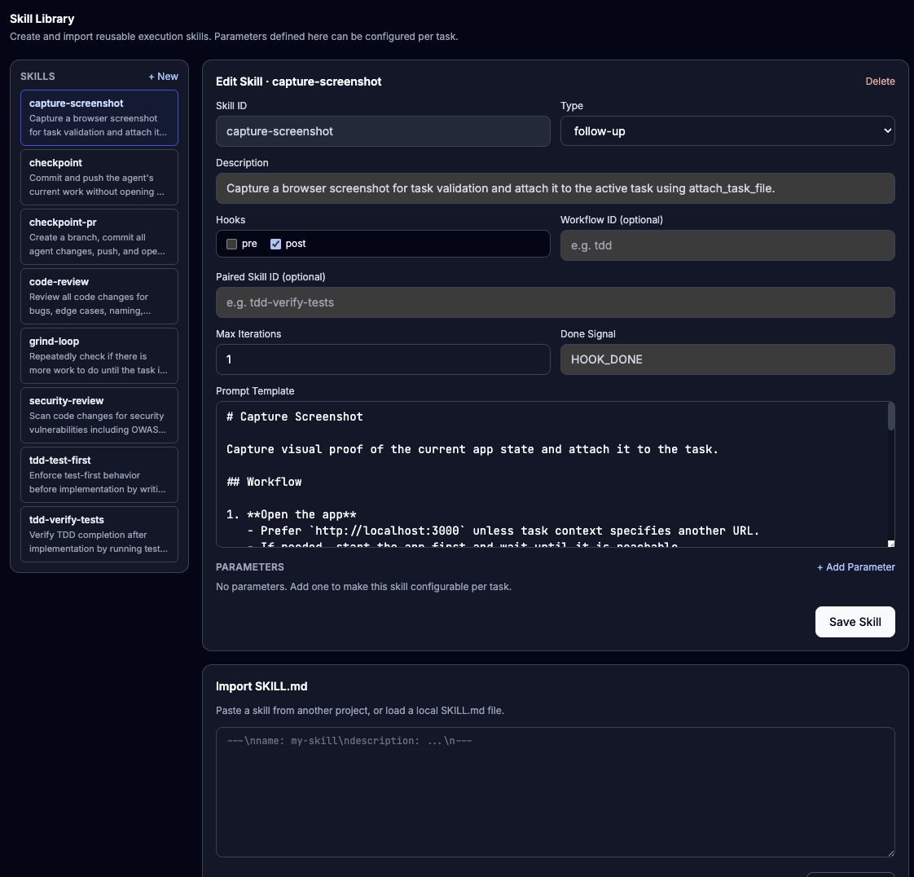

Then run those skills before or after tasks

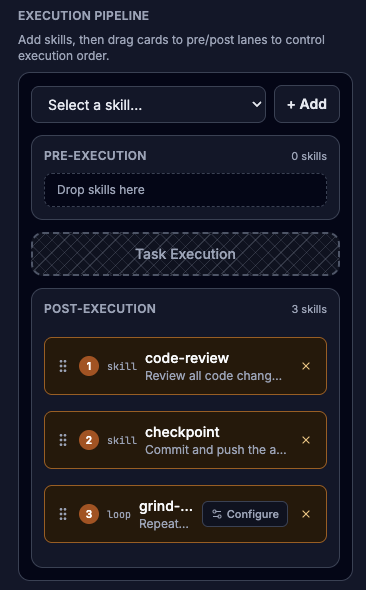

Attach sketches via embedded excalidraw

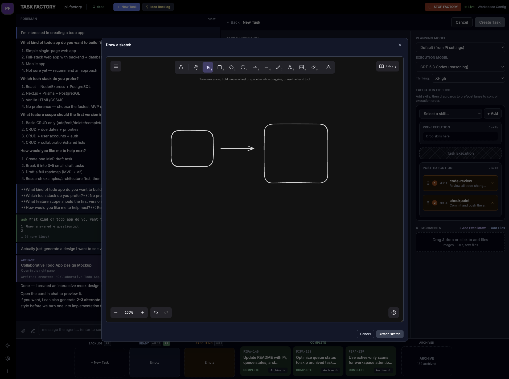

Tasks are archived and can be restored. Archived tasks contain all metadata including the full conversation

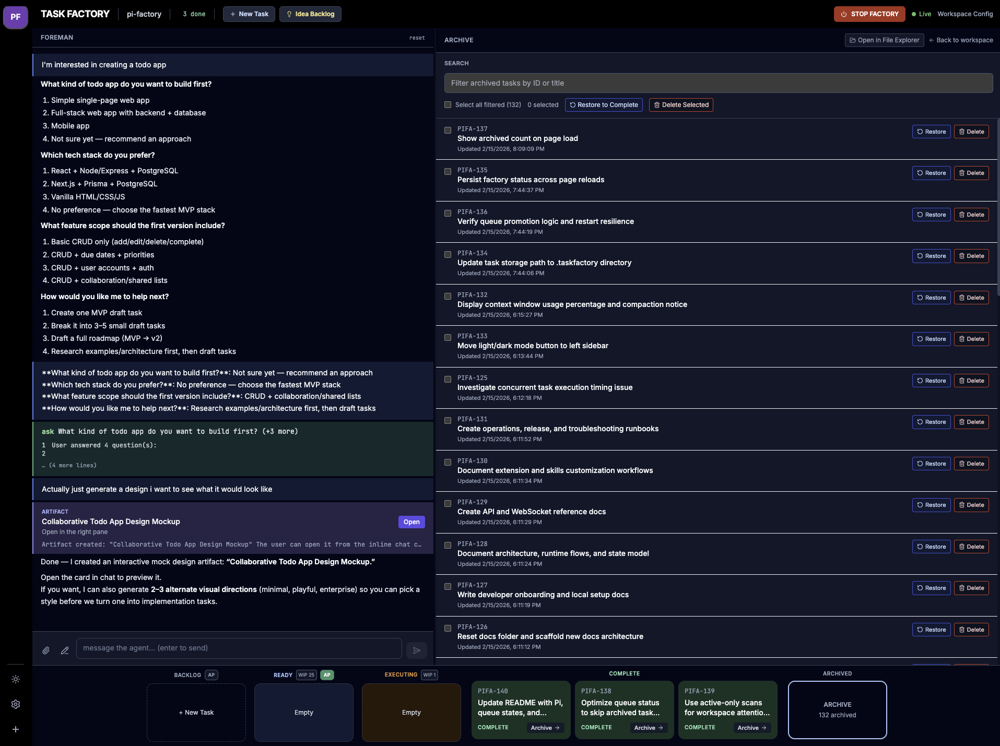

After tasks are completed, a summary is generated to give you a quick overview over the completed work

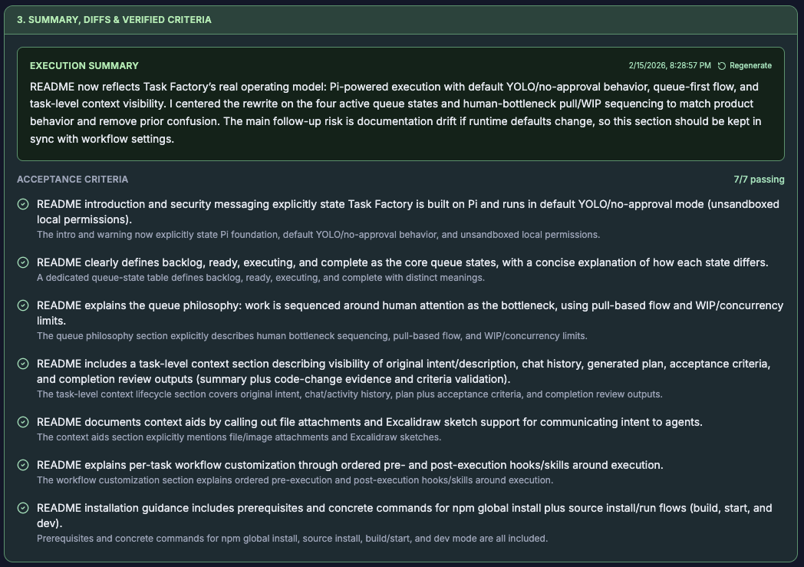

Track token usage and statistics on a per-task basis

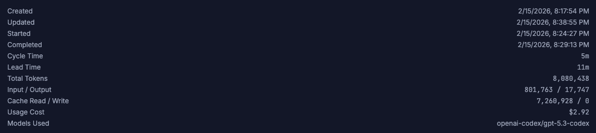

Global voice dictation with a keyboard shortcut using the browser's Web Speech API

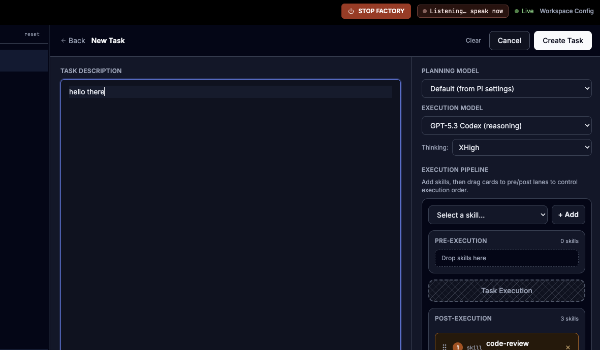

## License

MIT
